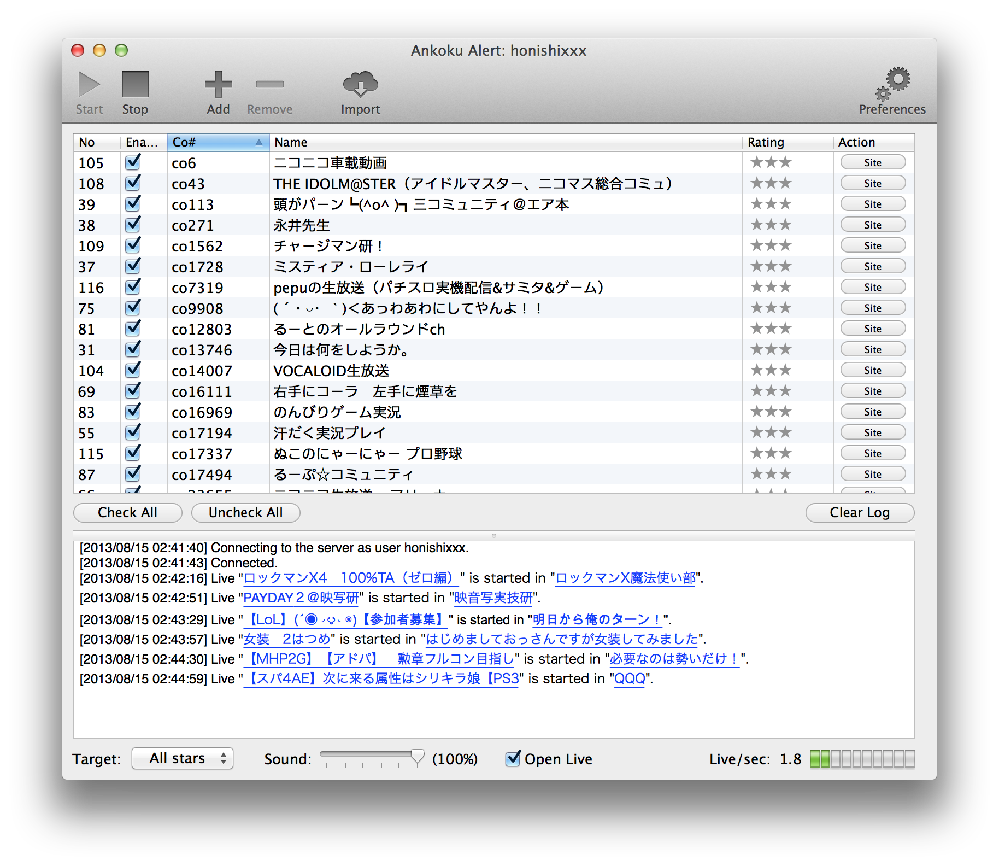

AnkokuAlert 2.x
=========
- Niconama alert alternative for OS X.
- Binary available at [Mac App Store](https://itunes.apple.com/jp/app/ankoku-alert/id447599289?l=en&mt=12).

screenshot
-


setup repository
-
````
brew insatll uncrustify
cd .git/hooks
ln -s ../../scripts/git-hooks/pre-commit
````
setup coredata
-
````
brew install mogenerator
mogenerator -m AnkokuAlert.xcdatamodeld/AnkokuAlert.xcdatamodel -O Models/ --template-var arc=true
````

license
-
copyright &copy; 2013- honishi, hiroyuki onishi.

distributed under the [MIT license][mit].
[mit]: http://www.opensource.org/licenses/mit-license.php
